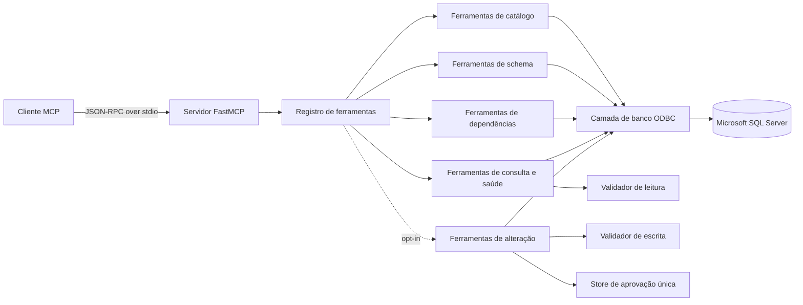

# mssql-mcp

Um servidor MCP (Model Context Protocol) com foco em leitura para descobrir, inspecionar, analisar e modificar com cautela bancos de dados Microsoft SQL Server.

O `mssql-mcp` oferece a clientes de IA compatíveis com MCP uma alternativa estruturada ao acesso ad hoc a bancos de dados. Ele expõe 15 ferramentas somente leitura para metadados e análise delimitada. Duas ferramentas adicionais de modificação de estado podem ser habilitadas explicitamente com listas de operações permitidas, confirmações de uso único, transações e controles de rollback.

> Limite de segurança: validação e confirmação são camadas de defesa em profundidade. As permissões do SQL Server permanecem como autoridade final. As ferramentas de modificação de estado estão ausentes por padrão e devem utilizar uma identidade dedicada com privilégios mínimos.

## Qual Problema Resolve

Grandes ambientes SQL Server são difíceis de compreender apenas pelos nomes das tabelas. O comportamento da aplicação pode estar distribuído entre stored procedures, views, funções, chaves estrangeiras e convenções de nomenclatura legadas. Este servidor permite que um cliente MCP responda perguntas como:

- Quais schemas, tabelas, views, procedures e funções existem?
- Quais colunas, chaves, chaves estrangeiras e índices definem uma tabela?
- Quais objetos referenciam uma tabela?
- De quais tabelas e objetos uma procedure depende?
- Onde um termo de negócio aparece em objetos SQL programáveis?
- Uma pequena consulta somente leitura pode confirmar uma hipótese sobre os dados?

## Destaques

- SDK oficial Python MCP via `stdio`.
- Autenticação integrada do Windows ou autenticação SQL.
- Consultas internas de metadados parametrizadas.
- Busca limitada por cursor e timeouts de consulta configuráveis.
- Paginação para catálogos grandes.
- Validador de leitura que rejeita DML, DDL, `SELECT INTO`, múltiplos statements, mutação de sequências, row locks perigosos e provedores de rowset externos.
- Ferramentas de escrita opcionais com listas de operações permitidas, fingerprints de consulta exatos, tokens de uso único com expiração, transações, rollback e limites de linhas afetadas.
- Anotações MCP destrutivas para que clientes compatíveis possam exigir confirmação humana.
- Injeção de dependência para testes unitários isolados.
- Cobertura de testes de 93%+ aplicada no CI.
- Logging opcional em texto simples ou JSON com rotação de arquivos.

## Arquitetura



A factory do servidor cria a configuração, um adaptador de banco de dados ODBC, serviços de ferramentas e o registro MCP. Os serviços de ferramentas dependem de um protocolo de banco de dados mínimo, então os testes utilizam fakes determinísticos em vez de um banco real. Consulte [docs/architecture.md](docs/architecture.md) para responsabilidades de componentes e fluxo de execução.

## Requisitos

- Python 3.11 ou mais recente.
- Microsoft SQL Server com acesso de rede a partir do host MCP.
- Microsoft ODBC Driver 18 para SQL Server, ou outro driver compatível configurado.
- Uma identidade SQL Server com visibilidade de metadados e permissões de leitura. Implantações com escrita habilitada requerem permissões DML ou DDL com escopo separado.

O projeto é desenvolvido no Windows, mas o pacote Python é portável para plataformas suportadas pelo `pyodbc` e pelo driver Microsoft ODBC.

## Instalação

```bash
git clone <repository-url>
cd mssql-mcp
python -m venv .venv
```

Ative o ambiente:

```powershell
# Windows PowerShell
.\.venv\Scripts\Activate.ps1
```

```bash
# Linux ou macOS
source .venv/bin/activate
```

Instale o pacote:

```bash
python -m pip install -e .
```

Para ferramentas de desenvolvimento:

```bash
python -m pip install -e ".[dev]"
```

## Configuração

Crie um arquivo de ambiente local:

```powershell
Copy-Item .env.example .env
```

```bash
cp .env.example .env
```

### Variáveis de Ambiente

| Variável | Padrão | Finalidade |
| --- | --- | --- |
| `MSSQL_CONNECTION_STRING` | vazio | String de conexão ODBC completa. Quando definida, tem precedência sobre os campos de conexão individuais abaixo. |
| `MSSQL_DRIVER` | `ODBC Driver 18 for SQL Server` | Nome do driver ODBC instalado. |
| `MSSQL_SERVER` | `localhost` | Host, instância ou listener do SQL Server. |
| `MSSQL_DATABASE` | `master` | Banco de dados inicial usado pelas ferramentas de metadados e consulta. |
| `MSSQL_TRUSTED_CONNECTION` | `yes` | Habilita autenticação integrada do Windows. |
| `MSSQL_USERNAME` | vazio | Login SQL quando a autenticação confiável está desabilitada. |
| `MSSQL_PASSWORD` | vazio | Senha SQL quando a autenticação confiável está desabilitada. |
| `MSSQL_ENCRYPT` | `yes` | Habilita transporte ODBC criptografado. |
| `MSSQL_TRUST_CERTIFICATE` | `no` | Ignora a validação da cadeia de certificados quando habilitado. Use apenas quando justificado. |
| `MSSQL_APPLICATION_INTENT` | `ReadOnly` | Declara intenção de leitura para o roteamento do SQL Server. Não concede nem aplica permissões. |
| `MSSQL_TIMEOUT_CONNECTION` | `10` | Timeout de conexão em segundos. |
| `MSSQL_TIMEOUT_QUERY` | `30` | Timeout por consulta em segundos. |
| `MSSQL_MAX_ROWS` | `100` | Número máximo de linhas retornadas por chamada de ferramenta. |
| `MSSQL_MAX_QUERY_LENGTH` | `10000` | Comprimento máximo aceito de consulta ad hoc. |
| `MSSQL_ENABLE_WRITE_TOOLS` | `no` | Registra as duas ferramentas de modificação de estado quando habilitado explicitamente. Requer intent `ReadWrite`. |
| `MSSQL_ALLOWED_WRITE_OPERATIONS` | `INSERT,UPDATE,DELETE` | Lista de operações permitidas separadas por vírgula. DDL nunca é habilitado implicitamente. |
| `MSSQL_MAX_AFFECTED_ROWS` | `100` | Reverte o DML quando o número de linhas afetadas reportado excede este valor. |
| `MSSQL_CHANGE_TOKEN_TTL_SECONDS` | `300` | Tempo de vida de uma aprovação de alteração SQL de uso único. |
| `MSSQL_MAX_PENDING_CHANGES` | `100` | Número máximo de aprovações em memória aguardando execução. |
| `MCP_SERVER_NAME` | `Microsoft SQL Server Explorer` | Nome apresentado aos clientes MCP. |
| `LOG_LEVEL` | `INFO` | Nível de logging do Python. |
| `LOG_FORMAT` | `plain` | `plain` ou `json`. |
| `LOG_FILE` | vazio | Caminho opcional para arquivo de log com rotação. Logs vão para stderr quando não definido. |
| `MSSQL_MCP_ENV_FILE` | vazio | Caminho explícito opcional para um arquivo de ambiente. |

### Exemplos de Autenticação

Autenticação integrada do Windows:

```ini
MSSQL_SERVER=sql.example.test
MSSQL_DATABASE=analytics
MSSQL_TRUSTED_CONNECTION=yes
```

Neste modo, nenhum usuário ou senha é necessário. O SQL Server recebe a identidade Windows do processo iniciado pelo cliente MCP. A conta que executa o cliente deve, portanto, ter permissão para acessar o banco de dados alvo.

Autenticação SQL:

```ini
MSSQL_TRUSTED_CONNECTION=no
MSSQL_USERNAME=mcp_reader
MSSQL_PASSWORD=substitua-pela-senha-real
```

String de conexão ODBC completa:

```ini
MSSQL_CONNECTION_STRING=Driver={ODBC Driver 18 for SQL Server};Server=tcp:sql.example.test,1433;Database=analytics;UID=mcp_reader;PWD=substitua-pela-senha-real;Encrypt=yes;TrustServerCertificate=no;ApplicationIntent=ReadOnly;
```

`MSSQL_CONNECTION_STRING` tem precedência sobre `MSSQL_DRIVER`, `MSSQL_SERVER`, `MSSQL_DATABASE` e campos de autenticação/TLS. Limites de recursos, timeouts, o nome do servidor e configurações de logging permanecem independentes.

Não coloque credenciais reais em configurações versionadas no controle de código-fonte. Para um cliente MCP local, mantenha sua configuração privada ou referencie segredos através do mecanismo de segredos suportado pelo cliente.

### Habilitando Alterações Controladas

Mantenha o modo somente leitura padrão a menos que alterações sejam necessárias. Uma configuração conservadora somente DML é:

```ini
MSSQL_APPLICATION_INTENT=ReadWrite
MSSQL_ENABLE_WRITE_TOOLS=yes
MSSQL_ALLOWED_WRITE_OPERATIONS=INSERT,UPDATE,DELETE
MSSQL_MAX_AFFECTED_ROWS=25
MSSQL_CHANGE_TOKEN_TTL_SECONDS=300
```

Os valores suportados na lista de operações são `INSERT`, `UPDATE`, `DELETE`, `CREATE_TABLE`, `ALTER_TABLE`, `DROP_TABLE`, `TRUNCATE_TABLE`, `CREATE_INDEX`, `ALTER_INDEX` e `DROP_INDEX`. Adicione DDL destrutivo apenas após revisar permissões, backups e o comportamento de confirmação do cliente.

Para uma string ODBC completa, use `ApplicationIntent=ReadWrite` ou omita essa chave. Defina também a flag de segurança `MSSQL_APPLICATION_INTENT=ReadWrite` separadamente para que a validação de inicialização possa confirmar que o modo de escrita foi intencional.

O template [vscode.write-enabled.mcp.json](examples/clients/vscode.write-enabled.mcp.json) usa Autenticação do Windows contra um banco de dados sandbox. Autenticação SQL e uma string de conexão completa funcionam da mesma forma.

## Executando o Servidor

Após a instalação:

```bash
mssql-mcp
```

Invocação equivalente por módulo:

```bash
python -m mssql_mcp
```

O processo usa `stdio`; normalmente aparece ocioso enquanto aguarda um cliente MCP. Os logs da aplicação são gravados em stderr para não corromper o fluxo do protocolo.

### Verificação de Conexão

```bash
python scripts/check_connection.py
```

O próprio servidor não falha na inicialização quando o SQL Server está indisponível. Use a ferramenta `health_check` ou o script acima para diagnóstico.

## Configuração do Cliente MCP

Templates estão disponíveis em [examples/clients](examples/clients). Substitua o caminho do interpretador de espaço reservado pelo executável Python onde o `mssql-mcp` está instalado.

Exemplo:

```json
{
  "mcpServers": {
    "mssql": {
      "command": "C:\\caminho\\para\\mssql-mcp\\.venv\\Scripts\\python.exe",
      "args": ["-m", "mssql_mcp"],
      "env": {
        "MSSQL_SERVER": "sql.example.test",
        "MSSQL_DATABASE": "analytics",
        "MSSQL_TRUSTED_CONNECTION": "yes"
      }
    }
  }
}
```

A autenticação SQL pode ser configurada por servidor MCP:

```json
{
  "servers": {
    "mssql-explorer": {
      "type": "stdio",
      "command": "C:\\caminho\\para\\.venv\\Scripts\\python.exe",
      "args": ["-m", "mssql_mcp"],
      "env": {
        "MSSQL_SERVER": "tcp:sql.example.test,1433",
        "MSSQL_DATABASE": "analytics",
        "MSSQL_TRUSTED_CONNECTION": "no",
        "MSSQL_USERNAME": "mcp_reader",
        "MSSQL_PASSWORD": "substitua-pela-senha-real",
        "MSSQL_ENCRYPT": "yes",
        "MSSQL_TRUST_CERTIFICATE": "no"
      }
    }
  }
}
```

Alternativamente, defina apenas `MSSQL_CONNECTION_STRING` dentro de `env` quando o provedor de banco de dados exigir opções ODBC adicionais. A string completa pode usar credenciais SQL (`UID` e `PWD`) ou autenticação do Windows (`Trusted_Connection=yes`). Quando `MSSQL_CONNECTION_STRING` está presente, ela é usada diretamente e tem precedência sobre os campos de conexão individuais.

Cada entrada de servidor pode apontar para um banco de dados diferente fornecendo um bloco de ambiente diferente. Templates prontos para uso estão disponíveis em `examples/clients/vscode.windows-auth.mcp.json` e `examples/clients/vscode.connection-string.mcp.json`.

Reinicie o cliente MCP após alterar sua configuração.

## Fluxo de Execução

1. O cliente MCP inicia `python -m mssql_mcp`.
2. `Settings.from_env()` valida a configuração de runtime.
3. O logging é configurado em stderr e opcionalmente em um arquivo com rotação.
4. `create_server()` sempre registra as 15 ferramentas somente leitura e condicionalmente registra duas ferramentas de alteração.
5. As ferramentas de leitura validam os argumentos e executam SQL de metadados parametrizado ou um `SELECT` delimitado.
6. Uma requisição de modificação de estado deve primeiro passar por `prepare_sql_change`, produzindo um token com expiração vinculado ao fingerprint exato do SQL.
7. `execute_sql_change` requer o SQL inalterado, o token de uso único e `confirm=true`.
8. `DatabaseManager` executa as alterações em uma transação explícita e confirma apenas após as verificações de limite de linhas; falhas fazem rollback.
9. Toda ferramenta retorna o envelope de resposta padrão.

## Formato de Resposta

As ferramentas retornam um objeto consistente:

```json
{
  "success": true,
  "data": [],
  "row_count": 0,
  "error": null,
  "metadata": {
    "limit": 100,
    "offset": 0,
    "has_more": false,
    "elapsed_ms": 12
  }
}
```

`metadata` varia por ferramenta. Os campos de nível superior existentes permanecem estáveis nas respostas de sucesso e falha.

## Ferramentas Disponíveis

| Ferramenta | Finalidade |
| --- | --- |
| `health_check` | Verifica a conectividade e reporta banco de dados, intenção de leitura e latência. |
| `get_database_overview` | Retorna versão do servidor, edição, configurações do banco de dados e contagens de objetos. |
| `list_databases` | Lista bancos de dados visíveis com paginação. |
| `list_schemas` | Lista schemas de usuário, proprietários e contagens de objetos. |
| `list_tables` | Lista tabelas com filtro de schema opcional e contagens aproximadas de linhas. |
| `list_views` | Lista views com filtro de schema opcional e paginação. |
| `list_procedures` | Lista stored procedures e contagens de parâmetros. |
| `list_functions` | Lista funções escalares e com retorno de tabela. |
| `describe_table` | Retorna colunas, chave primária, chaves estrangeiras e índices. |
| `get_procedure_code` | Retorna código-fonte e parâmetros de uma procedure. |
| `get_object_definition` | Retorna código-fonte de uma procedure, view ou função. |
| `find_table_usage` | Encontra objetos programáveis que referenciam uma tabela. |
| `find_procedure_dependencies` | Encontra tabelas, views, procedures e funções referenciadas por uma procedure. |
| `search_objects` | Pesquisa nomes de objetos e definições SQL sem retornar o texto-fonte completo. |
| `execute_select` | Executa um `SELECT` ou CTE `SELECT` validado com saída delimitada. |
| `prepare_sql_change` | Opt-in: valida uma alteração na lista de permitidos e emite um token de curta duração sem modificar o SQL Server. |
| `execute_sql_change` | Opt-in: executa o statement preparado exato de forma transacional após confirmação explícita. |

As ferramentas de catálogo aceitam `limit` e `offset`; `list_tables`, `list_views`, `list_procedures` e `list_functions` também aceitam um `schema` opcional.

`get_object_definition` aceita um `object_type` opcional: `procedure`, `view` ou `function`.

## Exemplos de Uso

### Explorar um Banco de Dados Desconhecido

1. Chame `health_check`.
2. Chame `get_database_overview`.
3. Chame `list_schemas`.
4. Chame `list_tables` para um schema relevante.
5. Chame `describe_table` para as tabelas candidatas.

### Fazer Engenharia Reversa de uma Procedure

1. Chame `search_objects` com um termo de negócio.
2. Chame `get_procedure_code` ou `get_object_definition`.
3. Chame `find_procedure_dependencies`.
4. Descreva as tabelas referenciadas.

### Rastrear o Uso de uma Tabela

1. Chame `describe_table` com um nome qualificado por schema.
2. Chame `find_table_usage`.
3. Recupere as definições das procedures, views ou funções retornadas.

### Validar uma Hipótese sobre os Dados

```sql
SELECT TOP 20
    CustomerId,
    COUNT(*) AS OrderCount
FROM sales.Orders
GROUP BY CustomerId
ORDER BY OrderCount DESC;
```

Use `execute_select` apenas após as ferramentas de metadados estabelecerem o schema e as colunas relevantes.

### Aplicar uma Alteração Controlada

1. Confirme o banco de dados alvo com `health_check` e inspecione a tabela alvo.
2. Chame `prepare_sql_change` com um statement exato, por exemplo:

```sql
UPDATE sales.Orders
SET ReviewStatus = 'Pending'
WHERE OrderId = 12345;
```

3. Revise o SQL, a operação, o fingerprint, o banco de dados alvo e o limite de linhas afetadas.
4. Após aprovação explícita do usuário, chame `execute_sql_change` com o SQL inalterado, o token retornado e `confirm=true`.
5. Verifique `committed`, `affected_rows` e o fingerprint na resposta.

Os tokens expiram, são de uso único e se tornam inválidos se qualquer byte do SQL for alterado. `UPDATE` e `DELETE` sem uma cláusula `WHERE` de nível superior são rejeitados. O DML é revertido quando o SQL Server não fornece uma contagem de linhas ou o limite configurado é excedido.

## Segurança

Execução somente leitura e execução com modificação de estado usam validadores separados. As ferramentas de escrita não são registradas a menos que sejam explicitamente habilitadas. Quando habilitadas, usam lista de operações permitidas, token de confirmação de consulta exato, expiração, consumo único, `ApplicationIntent=ReadWrite`, transações explícitas, `XACT_ABORT` e rollback em erros ou violações de limite de linhas DML.

Esses controles não podem provar a intenção do usuário nem substituir a autorização do banco de dados. Use:

- uma identidade dedicada com apenas as permissões de tabela/schema necessárias;
- uma entrada de servidor MCP separada para escritas;
- um valor baixo para `MSSQL_MAX_AFFECTED_ROWS`;
- UI de confirmação verificada no cliente para ferramentas destrutivas;
- SQL Server Audit, monitoramento, backups e procedimentos de recuperação testados;
- validação em sandbox ou ambiente não produtivo antes de habilitar DDL;
- nenhuma identidade `sysadmin`, `db_owner`, `CONTROL` amplo ou identidade administrativa pessoal.

O validador rejeita múltiplos statements, `UPDATE`/`DELETE` em tabela inteira sem `WHERE`, DDL multi-alvo, escritas explícitas entre bancos de dados, DDL de banco de dados/segurança/servidor, `MERGE`, `EXEC`, alterações de permissão, controle de transação, rowsets externos, backup/restore, triggers, operações em massa e comandos administrativos.

Consulte [docs/security.md](docs/security.md) para o modelo de ameaças e limitações conhecidas.

## Testes e Qualidade

```bash
ruff format --check .
ruff check .
pytest -m "not integration" --cov=mssql_mcp
pip-audit
```

Testes de integração ao vivo são opt-in:

```powershell
$env:RUN_MSSQL_INTEGRATION_TESTS = "1"
pytest -m integration
```

```bash
RUN_MSSQL_INTEGRATION_TESTS=1 pytest -m integration
```

O CI executa formatação, lint, testes unitários, cobertura e auditoria de dependências. O Dependabot monitora pacotes Python e GitHub Actions.

## Estrutura do Projeto

```text
.
|-- .github/                 # CI, atualizações de dependências, templates de issues e PRs
|-- docs/                    # Documentação de arquitetura e segurança
|-- examples/
|   |-- clients/             # Templates de configuração de clientes MCP
|   `-- queries.md           # Exemplos de uso seguro
|-- scripts/
|   `-- check_connection.py  # Verificação de configuração e conectividade
|-- src/mssql_mcp/
|   |-- change_control.py    # Aprovações únicas com expiração para fingerprints SQL exatos
|   |-- config.py            # Configurações de ambiente, autenticação e segurança de escrita
|   |-- database.py          # Leituras delimitadas e alterações ODBC transacionais
|   |-- logging_config.py    # Logging em stderr, JSON e arquivo com rotação
|   |-- security.py          # Validadores SQL separados para leitura e modificação de estado
|   |-- server.py            # Factory FastMCP e registro condicional de ferramentas
|   `-- tools/               # Serviços de catálogo, schema, dependências, consulta, alteração e registro
|-- tests/                   # Testes unitários e de integração opt-in
|-- .env.example
|-- pyproject.toml
`-- README.md
```

## Limitações

- Os metadados de dependência podem estar incompletos para SQL dinâmico, módulos criptografados, referências entre bancos de dados não resolvidas ou objetos criados com resolução de nomes diferida.
- `ApplicationIntent=ReadOnly` é uma dica de roteamento, não um controle de autorização.
- As linhas retornadas são limitadas, mas o SQL Server pode ainda realizar trabalho custoso antes de produzi-las; timeout e governança de carga de trabalho do banco de dados continuam sendo importantes.
- A pesquisa depende da visibilidade de `sys.sql_modules` e não retorna definições criptografadas.
- As contagens de linhas de tabelas são derivadas de partições e são metadados aproximados, não resultados transacionais de `COUNT(*)`.
- A validação de modificação de estado é uma análise léxica conservadora, não um parser T-SQL completo nem uma prova de intenção do usuário.
- Triggers, cascatas, sinônimos e recursos do lado do servidor podem criar efeitos além do statement visível; permissões e auditoria continuam sendo obrigatórias.
- Referências explícitas de escrita com três partes são rejeitadas, mas o comportamento indireto entre bancos de dados ainda deve ser prevenido pelas permissões e pelo design do SQL Server.
- O projeto atualmente não expõe transportes HTTP ou troca de banco de dados dentro de um único processo de servidor.

## Solução de Problemas

### Driver ODBC não encontrado

Liste os drivers instalados:

```python
import pyodbc
print(pyodbc.drivers())
```

Defina `MSSQL_DRIVER` com um nome instalado. Instale o Microsoft ODBC Driver 18 quando ausente.

### Falha na validação do certificado

Use um certificado confiável pelo host MCP. `MSSQL_TRUST_CERTIFICATE=yes` está disponível para ambientes de desenvolvimento controlados, mas enfraquece a validação de identidade TLS.

### Falha de login

Confirme o modo de autenticação selecionado. Com autenticação confiável, o processo do cliente MCP executa como o usuário da aplicação desktop ou identidade de serviço, que pode diferir de um shell interativo.

### Metadados ausentes

A visibilidade de metadados do SQL Server segue as permissões. Conceda apenas as permissões `VIEW DEFINITION` e `SELECT` necessárias; não use papéis administrativos amplos para resolver problemas de descoberta.

### Consulta expirou

Reduza o escopo da consulta, adicione predicados seletivos, verifique índices ou ajuste `MSSQL_TIMEOUT_QUERY` após avaliar o impacto na carga de trabalho.

### Resposta da ferramenta truncada

Use paginação para ferramentas de catálogo. Para `execute_select`, adicione um predicado seletivo ou uma cláusula `TOP` determinística. `MSSQL_MAX_ROWS` é um limite de segurança de saída.

### Cliente MCP não consegue iniciar o servidor

Use um caminho absoluto para o interpretador Python na configuração do cliente e verifique se esse interpretador consegue executar:

```bash
<caminho-python> -m mssql_mcp
```

Os logs devem permanecer em stderr. Não adicione saída `print()` à inicialização do servidor.

## Roadmap

- Adicionar transporte Streamable HTTP opcional com orientações de autenticação.
- Adicionar listas de bancos de dados permitidos para implantações multi-banco controladas.
- Adicionar relatórios de dependências entre bancos de dados mais ricos.
- Adicionar preflight de custo de consulta usando planos de execução estimados onde as permissões permitirem.
- Publicar releases assinados e um software bill of materials.
- Selecionar e adicionar uma licença explícita ao repositório.

## Licença

Nenhuma licença foi selecionada. Até que o proprietário do repositório adicione uma, o código-fonte permanece sob proteção de direitos autorais padrão e não é automaticamente de código aberto.