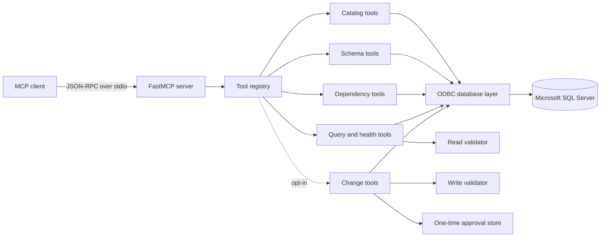

# mssql-mcp

A read-first Model Context Protocol (MCP) server for discovering, inspecting, analyzing, and carefully changing Microsoft SQL Server databases.

`mssql-mcp` gives MCP-compatible AI clients a structured alternative to ad hoc database access. It exposes 15 read-only tools for metadata and bounded analysis. Two additional state-changing tools can be enabled explicitly with operation allowlists, one-time confirmations, transactions, and rollback controls.

> Security boundary: validation and confirmation are defense in depth. SQL Server permissions remain authoritative. State-changing tools are absent by default and must use a dedicated least-privilege identity.

## What Problem It Solves

Large SQL Server estates are difficult to understand from table names alone. Application behavior may be distributed across stored procedures, views, functions, foreign keys, and legacy naming conventions. This server lets an MCP client answer questions such as:

- Which schemas, tables, views, procedures, and functions exist?
- What columns, keys, foreign keys, and indexes define a table?
- Which objects reference a table?
- Which tables and objects does a procedure depend on?
- Where does a business term appear in programmable SQL objects?
- Can a small read-only query confirm a hypothesis about the data?

## Highlights

- Official Python MCP SDK over `stdio`.
- Windows integrated authentication or SQL authentication.
- Parameterized internal metadata queries.
- Bounded cursor fetching and configurable query timeouts.
- Pagination for large catalogs.
- Read validator that rejects DML, DDL, `SELECT INTO`, multiple statements, sequence mutation, dangerous row locks, and external rowset providers.
- Optional write tools with operation allowlists, exact-query fingerprints, expiring one-time tokens, transactions, rollback, and affected-row limits.
- Destructive MCP annotations so compatible clients can require human confirmation.
- Dependency injection for isolated unit testing.
- 93%+ test coverage enforced in CI.
- Optional plain or JSON logging with file rotation.

## Architecture



The server factory creates configuration, an ODBC database adapter, tool services, and the MCP registry. Tool services depend on a small database protocol, so tests use deterministic fakes instead of a live database. See [docs/architecture.md](docs/architecture.md) for component responsibilities and execution flow.

## Requirements

- Python 3.11 or newer.
- Microsoft SQL Server with network access from the MCP host.
- Microsoft ODBC Driver 18 for SQL Server, or another configured compatible driver.
- A SQL Server identity with metadata visibility and read permissions. Write-enabled deployments require separately scoped DML or DDL permissions.

The project is developed on Windows but the Python package is portable to platforms supported by `pyodbc` and the Microsoft ODBC driver.

## Installation

```bash
git clone <repository-url>
cd mssql-mcp
python -m venv .venv
```

Activate the environment:

```powershell
# Windows PowerShell
.\.venv\Scripts\Activate.ps1
```

```bash
# Linux or macOS
source .venv/bin/activate
```

Install the package:

```bash
python -m pip install -e .
```

For development tools:

```bash
python -m pip install -e ".[dev]"
```

## Configuration

Create a local environment file:

```powershell
Copy-Item .env.example .env
```

```bash
cp .env.example .env
```

### Environment Variables

| Variable | Default | Purpose |
| --- | --- | --- |
| `MSSQL_CONNECTION_STRING` | empty | Complete ODBC connection string. When set, it takes precedence over the individual connection fields below. |
| `MSSQL_DRIVER` | `ODBC Driver 18 for SQL Server` | Installed ODBC driver name. |
| `MSSQL_SERVER` | `localhost` | SQL Server host, instance, or listener. |
| `MSSQL_DATABASE` | `master` | Initial database used by metadata and query tools. |
| `MSSQL_TRUSTED_CONNECTION` | `yes` | Enables Windows integrated authentication. |
| `MSSQL_USERNAME` | empty | SQL login when trusted authentication is disabled. |
| `MSSQL_PASSWORD` | empty | SQL password when trusted authentication is disabled. |
| `MSSQL_ENCRYPT` | `yes` | Enables encrypted ODBC transport. |
| `MSSQL_TRUST_CERTIFICATE` | `no` | Bypasses certificate-chain validation when enabled. Use only when justified. |
| `MSSQL_APPLICATION_INTENT` | `ReadOnly` | Declares read intent to SQL Server routing. This does not grant or enforce permissions. |
| `MSSQL_TIMEOUT_CONNECTION` | `10` | Connection timeout in seconds. |
| `MSSQL_TIMEOUT_QUERY` | `30` | Per-query timeout in seconds. |
| `MSSQL_MAX_ROWS` | `100` | Maximum rows returned by one tool call. |
| `MSSQL_MAX_QUERY_LENGTH` | `10000` | Maximum accepted ad hoc query length. |
| `MSSQL_ENABLE_WRITE_TOOLS` | `no` | Registers the two state-changing tools when explicitly enabled. Requires `ReadWrite` intent. |
| `MSSQL_ALLOWED_WRITE_OPERATIONS` | `INSERT,UPDATE,DELETE` | Comma-separated operation allowlist. DDL is never enabled implicitly. |
| `MSSQL_MAX_AFFECTED_ROWS` | `100` | Rolls back DML when the reported affected-row count exceeds this value. |
| `MSSQL_CHANGE_TOKEN_TTL_SECONDS` | `300` | Lifetime of a one-time SQL change approval. |
| `MSSQL_MAX_PENDING_CHANGES` | `100` | Maximum in-memory approvals awaiting execution. |
| `MCP_SERVER_NAME` | `Microsoft SQL Server Explorer` | Name presented to MCP clients. |
| `LOG_LEVEL` | `INFO` | Python logging level. |
| `LOG_FORMAT` | `plain` | `plain` or `json`. |
| `LOG_FILE` | empty | Optional rotating log file path. Logs otherwise go to stderr only. |
| `MSSQL_MCP_ENV_FILE` | empty | Optional explicit path to an environment file. |

### Authentication Examples

Windows integrated authentication:

```ini
MSSQL_SERVER=sql.example.test
MSSQL_DATABASE=analytics
MSSQL_TRUSTED_CONNECTION=yes
```

No username or password is required in this mode. SQL Server receives the Windows
identity of the process started by the MCP client. The account running the client
must therefore have permission to access the target database.

SQL authentication:

```ini
MSSQL_TRUSTED_CONNECTION=no
MSSQL_USERNAME=mcp_reader
MSSQL_PASSWORD=replace-with-a-secret
```

Complete ODBC connection string:

```ini
MSSQL_CONNECTION_STRING=Driver={ODBC Driver 18 for SQL Server};Server=tcp:sql.example.test,1433;Database=analytics;UID=mcp_reader;PWD=replace-with-a-secret;Encrypt=yes;TrustServerCertificate=no;ApplicationIntent=ReadOnly;
```

`MSSQL_CONNECTION_STRING` takes precedence over `MSSQL_DRIVER`, `MSSQL_SERVER`,
`MSSQL_DATABASE`, and authentication/TLS fields. Resource limits, timeouts, the
server name, and logging settings remain independent.

Do not place real credentials in configuration committed to source control. For a
local MCP client, keep its configuration private or reference secrets through the
client's supported secret mechanism.

### Enabling Controlled Changes

Keep the default read-only mode unless changes are required. A conservative DML-only configuration is:

```ini
MSSQL_APPLICATION_INTENT=ReadWrite
MSSQL_ENABLE_WRITE_TOOLS=yes
MSSQL_ALLOWED_WRITE_OPERATIONS=INSERT,UPDATE,DELETE
MSSQL_MAX_AFFECTED_ROWS=25
MSSQL_CHANGE_TOKEN_TTL_SECONDS=300
```

Supported allowlist values are `INSERT`, `UPDATE`, `DELETE`, `CREATE_TABLE`,
`ALTER_TABLE`, `DROP_TABLE`, `TRUNCATE_TABLE`, `CREATE_INDEX`, `ALTER_INDEX`,
and `DROP_INDEX`. Add destructive DDL only after reviewing permissions, backups,
and client confirmation behavior.

For a complete ODBC string, use `ApplicationIntent=ReadWrite` or omit that key.
Also set the separate `MSSQL_APPLICATION_INTENT=ReadWrite` safety flag so startup
validation can confirm that write mode was intentional.

The template [vscode.write-enabled.mcp.json](examples/clients/vscode.write-enabled.mcp.json)
uses Windows Authentication against a sandbox database. SQL Authentication and a
full connection string work the same way.

## Running the Server

After installation:

```bash
mssql-mcp
```

Equivalent module invocation:

```bash
python -m mssql_mcp
```

The process uses `stdio`; it normally appears idle while waiting for an MCP client. Application logs are written to stderr so they do not corrupt the protocol stream.

### Connection Check

```bash
python scripts/check_connection.py
```

The server itself does not fail startup when SQL Server is unavailable. Use the `health_check` tool or the script above for diagnosis.

## MCP Client Configuration

Templates are available under [examples/clients](examples/clients). Replace the placeholder interpreter path with the Python executable where `mssql-mcp` is installed.

Example:

```json
{
  "mcpServers": {
    "mssql": {
      "command": "C:\\path\\to\\mssql-mcp\\.venv\\Scripts\\python.exe",
      "args": ["-m", "mssql_mcp"],
      "env": {
        "MSSQL_SERVER": "sql.example.test",
        "MSSQL_DATABASE": "analytics",
        "MSSQL_TRUSTED_CONNECTION": "yes"
      }
    }
  }
}
```

SQL authentication can be configured per MCP server:

```json
{
  "servers": {
    "mssql-explorer": {
      "type": "stdio",
      "command": "C:\\path\\to\\.venv\\Scripts\\python.exe",
      "args": ["-m", "mssql_mcp"],
      "env": {
        "MSSQL_SERVER": "tcp:sql.example.test,1433",
        "MSSQL_DATABASE": "analytics",
        "MSSQL_TRUSTED_CONNECTION": "no",
        "MSSQL_USERNAME": "mcp_reader",
        "MSSQL_PASSWORD": "replace-with-a-secret",
        "MSSQL_ENCRYPT": "yes",
        "MSSQL_TRUST_CERTIFICATE": "no"
      }
    }
  }
}
```

Alternatively, set only `MSSQL_CONNECTION_STRING` inside `env` when the database
provider requires additional ODBC options. The complete string may use SQL
credentials (`UID` and `PWD`) or Windows authentication (`Trusted_Connection=yes`).
When `MSSQL_CONNECTION_STRING` is present, it is used as-is and takes precedence
over the individual connection fields.

Each server entry can point to a different database by supplying a different
environment block. Ready-to-use templates are provided in
`examples/clients/vscode.windows-auth.mcp.json` and
`examples/clients/vscode.connection-string.mcp.json`.

Restart the MCP client after changing its configuration.

## Execution Flow

1. The MCP client starts `python -m mssql_mcp`.
2. `Settings.from_env()` validates runtime configuration.
3. Logging is configured on stderr and optionally in a rotating file.
4. `create_server()` always registers the 15 read-only tools and conditionally registers two change tools.
5. Read tools validate arguments and execute parameterized metadata SQL or one bounded `SELECT`.
6. A state-changing request must first pass `prepare_sql_change`, producing an expiring token bound to the exact SQL fingerprint.
7. `execute_sql_change` requires unchanged SQL, the one-time token, and `confirm=true`.
8. `DatabaseManager` executes changes in an explicit transaction and commits only after row-limit checks; failures roll back.
9. Every tool returns the stable response envelope.

## Response Format

Tools return a consistent object:

```json
{
  "success": true,
  "data": [],
  "row_count": 0,
  "error": null,
  "metadata": {
    "limit": 100,
    "offset": 0,
    "has_more": false,
    "elapsed_ms": 12
  }
}
```

`metadata` varies by tool. Existing top-level fields remain stable across success and failure responses.

## Available Tools

| Tool | Purpose |
| --- | --- |
| `health_check` | Verify connectivity and report database, read intent, and latency. |
| `get_database_overview` | Return server version, edition, database settings, and object counts. |
| `list_databases` | List visible databases with pagination. |
| `list_schemas` | List user schemas, owners, and object counts. |
| `list_tables` | List tables with optional schema filter and approximate row counts. |
| `list_views` | List views with optional schema filter and pagination. |
| `list_procedures` | List stored procedures and parameter counts. |
| `list_functions` | List scalar and table-valued functions. |
| `describe_table` | Return columns, primary key, foreign keys, and indexes. |
| `get_procedure_code` | Return procedure source and parameters. |
| `get_object_definition` | Return source for a procedure, view, or function. |
| `find_table_usage` | Find programmable objects that reference a table. |
| `find_procedure_dependencies` | Find tables, views, procedures, and functions referenced by a procedure. |
| `search_objects` | Search object names and SQL definitions without returning full source text. |
| `execute_select` | Execute one validated read-oriented `SELECT` or `SELECT` CTE with bounded output. |
| `prepare_sql_change` | Opt-in: validate one allowlisted change and issue a short-lived token without modifying SQL Server. |
| `execute_sql_change` | Opt-in: execute the exact prepared statement transactionally after explicit confirmation. |

Catalog tools accept `limit` and `offset`; `list_tables`, `list_views`, `list_procedures`, and `list_functions` also accept an optional `schema`.

`get_object_definition` accepts an optional `object_type`: `procedure`, `view`, or `function`.

## Usage Examples

### Explore an Unknown Database

1. Call `health_check`.
2. Call `get_database_overview`.
3. Call `list_schemas`.
4. Call `list_tables` for a relevant schema.
5. Call `describe_table` for candidate tables.

### Reverse Engineer a Procedure

1. Call `search_objects` with a business term.
2. Call `get_procedure_code` or `get_object_definition`.
3. Call `find_procedure_dependencies`.
4. Describe the referenced tables.

### Trace Table Usage

1. Call `describe_table` with a schema-qualified name.
2. Call `find_table_usage`.
3. Retrieve definitions for the returned procedures, views, or functions.

### Validate a Data Hypothesis

```sql
SELECT TOP 20
    CustomerId,
    COUNT(*) AS OrderCount
FROM sales.Orders
GROUP BY CustomerId
ORDER BY OrderCount DESC;
```

Use `execute_select` only after metadata tools establish the relevant schema and columns.

### Apply a Controlled Change

1. Confirm the target database with `health_check` and inspect the target table.
2. Call `prepare_sql_change` with one exact statement, for example:

```sql
UPDATE sales.Orders
SET ReviewStatus = 'Pending'
WHERE OrderId = 12345;
```

3. Review the SQL, operation, fingerprint, target database, and affected-row limit.
4. After explicit user approval, call `execute_sql_change` with the unchanged SQL, returned token, and `confirm=true`.
5. Verify `committed`, `affected_rows`, and the fingerprint in the response.

Tokens expire, are one-time, and become invalid if any SQL byte changes. `UPDATE`
and `DELETE` without a top-level `WHERE` are rejected. DML is rolled back when SQL
Server does not provide a row count or the configured limit is exceeded.

## Security

Read-only execution and state-changing execution use separate validators. Write tools
are not registered unless explicitly enabled. When enabled, they use an operation
allowlist, exact-query confirmation token, expiration, one-time consumption,
`ApplicationIntent=ReadWrite`, explicit transactions, `XACT_ABORT`, and rollback on
errors or DML row-limit violations.

These controls cannot prove user intent or replace database authorization. Use:

- a dedicated identity with only required table/schema permissions;
- a separate MCP server entry for writes;
- a low `MSSQL_MAX_AFFECTED_ROWS` value;
- verified client confirmation UI for destructive tools;
- SQL Server Audit, monitoring, backups, and tested recovery procedures;
- sandbox or non-production validation before enabling DDL;
- no `sysadmin`, `db_owner`, broad `CONTROL`, or personal admin identity.

The validator rejects multiple statements, full-table `UPDATE`/`DELETE` without a
`WHERE`, multi-target DDL, explicit cross-database writes, database/security/server
DDL, `MERGE`, `EXEC`, permission changes, transaction control, external rowsets,
backup/restore, triggers, bulk operations, and administrative commands.

See [docs/security.md](docs/security.md) for the threat model and known limitations.

## Testing and Quality

```bash
ruff format --check .
ruff check .
pytest -m "not integration" --cov=mssql_mcp
pip-audit
```

Live integration tests are opt-in:

```powershell
$env:RUN_MSSQL_INTEGRATION_TESTS = "1"
pytest -m integration
```

```bash
RUN_MSSQL_INTEGRATION_TESTS=1 pytest -m integration
```

CI runs formatting, lint, unit tests, coverage, and dependency auditing. Dependabot monitors Python packages and GitHub Actions.

## Project Structure

```text
.
|-- .github/                 # CI, dependency updates, issue and PR templates
|-- docs/                    # Architecture and security documentation
|-- examples/
|   |-- clients/             # MCP client configuration templates
|   `-- queries.md           # Safe usage examples
|-- scripts/
|   `-- check_connection.py  # Configuration and connectivity smoke check
|-- src/mssql_mcp/
|   |-- change_control.py    # Expiring one-time approvals for exact SQL fingerprints
|   |-- config.py            # Environment, authentication, and write safety settings
|   |-- database.py          # Bounded reads and transactional ODBC changes
|   |-- logging_config.py    # Stderr, JSON, and rotating-file logging
|   |-- security.py          # Separate read and state-changing SQL validators
|   |-- server.py            # FastMCP factory and conditional tool registration
|   `-- tools/               # Catalog, schema, dependency, query, change, and registry services
|-- tests/                   # Unit and opt-in integration tests
|-- .env.example
|-- pyproject.toml
`-- README.md
```

## Limitations

- Dependency metadata can be incomplete for dynamic SQL, encrypted modules, unresolved cross-database references, or objects created with deferred name resolution.
- `ApplicationIntent=ReadOnly` is a routing hint, not an authorization control.
- Returned rows are capped, but SQL Server may still perform expensive work before producing them; timeout and database workload governance remain important.
- Search depends on `sys.sql_modules` visibility and does not return encrypted definitions.
- Table row counts are derived from partitions and are approximate metadata, not transactional `COUNT(*)` results.
- State-changing validation is conservative lexical analysis, not a complete T-SQL parser or proof of user intent.
- Triggers, cascades, synonyms, and server-side features can create effects beyond the visible statement; permissions and auditing remain mandatory.
- Explicit three-part write references are rejected, but indirect cross-database behavior must still be prevented through SQL Server permissions and design.
- The project does not currently expose HTTP transports or multi-database switching within one server process.

## Troubleshooting

### ODBC driver not found

List installed drivers:

```python
import pyodbc
print(pyodbc.drivers())
```

Set `MSSQL_DRIVER` to an installed name. Install Microsoft ODBC Driver 18 when absent.

### Certificate validation failure

Use a certificate trusted by the MCP host. `MSSQL_TRUST_CERTIFICATE=yes` is available for controlled development environments but weakens TLS identity validation.

### Login failed

Confirm the selected authentication mode. With trusted authentication, the MCP client process runs as the desktop application user or service identity, which may differ from an interactive shell.

### Metadata is missing

SQL Server metadata visibility follows permissions. Grant only the required `VIEW DEFINITION` and `SELECT` permissions; do not use broad administrative roles to solve discovery issues.

### Query timed out

Reduce query scope, add selective predicates, verify indexes, or adjust `MSSQL_TIMEOUT_QUERY` after assessing workload impact.

### Tool response is truncated

Use pagination for catalog tools. For `execute_select`, add a selective predicate or deterministic `TOP` clause. `MSSQL_MAX_ROWS` is an output safety limit.

### MCP client cannot start the server

Use an absolute Python interpreter path in the client config and verify that interpreter can run:

```bash
<python-path> -m mssql_mcp
```

Logs must remain on stderr. Do not add `print()` output to server startup.

## Roadmap

- Add optional Streamable HTTP transport with authentication guidance.
- Add database allowlists for controlled multi-database deployments.
- Add richer cross-database dependency reporting.
- Add query cost preflight using estimated execution plans where permissions allow.
- Publish signed releases and a software bill of materials.
- Select and add an explicit repository license.

## License

No license has been selected. Until the repository owner adds one, the source remains under default copyright protection and is not automatically open source.
